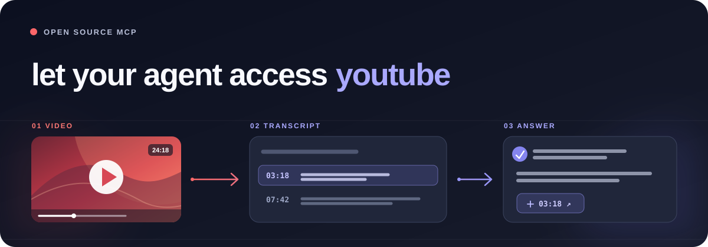

<div align="center">
  

  # YouTube Transcript MCP

  **Ask your AI about a YouTube video. Get an answer you can click back to.**

  [](https://github.com/scandolo/youtube-transcript-mcp/actions/workflows/checks.yml) [](LICENSE) [](pyproject.toml) [](https://modelcontextprotocol.io/)

  **[Set up on Railway →](https://railway.com/new)**

  [Get started](#get-started) · [Give setup to your agent](#give-setup-to-your-agent) · [Run locally](#run-locally) · [What it does](#what-it-does)
</div>

Turn raw captions into readable paragraphs with chapters, timestamps, and links to the exact moment in the video. Search YouTube, inspect a video, then pull only the chapter or passages you need. Works as a remote MCP connector for Claude and supported ChatGPT plans, or as a local stdio server.

> [!IMPORTANT]
> Railway hosting and a **rotating residential proxy** can cost money. YouTube frequently blocks caption requests from cloud IPs. The Railway deployment stays in safe setup mode until its proxy and OAuth settings are complete.

## Contents

- [Get started](#get-started)
- [Give setup to your agent](#give-setup-to-your-agent)
- [Try your first question](#try-your-first-question)
- [What it does](#what-it-does)
- [Run locally](#run-locally)
- [Troubleshooting](#troubleshooting)
- [Configuration and security](#configuration-and-security)
- [License](#license)

## Get started

You need a [Railway account](https://railway.com/), a [GitHub account](https://github.com/), and a [Webshare Residential](https://dashboard.webshare.io/) rotating proxy. The proxy's plain username and password are in Webshare's **Residential** settings. A free or static proxy product may not work for captions.

### 1. Deploy

Open **Set up on Railway** above, choose **Deploy from GitHub repo**, and select `scandolo/youtube-transcript-mcp`. Railway finds the Dockerfile automatically. In the service's **Settings**, set the health check path to `/healthz`, generate a public domain under **Networking**, and attach a volume mounted at `/data` to keep OAuth connections across deploys. Copy your `https://…up.railway.app` URL.

The first deployment is intentionally in setup mode: `/healthz` tells you which settings remain, and `/mcp` does not serve tools until setup is complete.

### 2. Create a GitHub OAuth app

Open [GitHub Developer settings → OAuth Apps](https://github.com/settings/developers) and choose **New OAuth App**. Use any name. Set **Homepage URL** to your Railway URL and **Authorization callback URL** to:

```text
https://YOUR-DOMAIN/auth/callback
```

Replace `YOUR-DOMAIN` with your actual Railway hostname, without `https://` inside that placeholder. Copy the **Client ID** and generate a **Client secret**.

### 3. Add five Railway variables

In your Railway service, open **Variables** and add these values. Railway redeploys after you save them.

| Variable | What to enter |
|---|---|
| `YTM_ALLOWED_USERS` | Your GitHub username, for example `scandolo`. Separate multiple usernames with commas. |
| `GITHUB_CLIENT_ID` | The OAuth app's client ID. |
| `GITHUB_CLIENT_SECRET` | The OAuth app's client secret. |
| `WEBSHARE_PROXY_USERNAME` | Your plain **Residential** proxy username, without `-rotate`. |
| `WEBSHARE_PROXY_PASSWORD` | Your Residential proxy password. |

Visit `https://YOUR-DOMAIN/healthz`. You are ready when it says `"status":"ok"`. Railway supplies the domain and port automatically; GitHub is the default OAuth provider on Railway.

### 4. Connect your AI app

Your MCP URL is **`https://YOUR-DOMAIN/mcp`**. Use that URL, then sign in with an allowlisted GitHub account.

| Client | Where to paste the MCP URL |
|---|---|
| **Claude** | **Customize → Connectors → + → Add custom connector**, then enable it in a chat with **+ → Connectors**. On Team or Enterprise, an owner adds it in organization settings. [Claude instructions](https://support.claude.com/en/articles/11175166-get-started-with-custom-connectors-using-remote-mcp). |
| **ChatGPT** | On a supported plan, enable developer mode; in **Settings → Apps → Create**, enter the MCP URL, choose OAuth, scan tools, and create the app. Availability varies by plan and workspace. [ChatGPT instructions](https://help.openai.com/en/articles/12584461-developer-mode-and-mcp-apps-in-chatgpt). |
| **Claude Code** | Run the command below, then use `/mcp` in Claude Code to sign in. |

```bash
claude mcp add --transport http --scope user youtube-transcript https://YOUR-DOMAIN/mcp
```

## Give setup to your agent

Copy this into your coding agent if you want it to guide you through Railway. Keep passwords and client secrets in Railway's Variables UI, not in the chat.

```text
Help me set up https://github.com/scandolo/youtube-transcript-mcp on Railway.
Read the current README first. Walk me through the
shortest path: deploy, copy my Railway domain, create a GitHub OAuth app with
the exact callback URL, add the five required Railway variables, verify
/healthz says ok, and connect /mcp to my AI app. Ask me which AI app I use.
I will enter secrets directly in Railway; do not ask me to paste them here.
Pause before any paid signup or purchase.
```

## Try your first question

Paste a video URL into your AI app and ask:

> Use the YouTube Transcript connector to summarize this video. Link the exact moment that supports each point: `https://www.youtube.com/watch?v=kCc8FmEb1nY`

For a long video, ask for its chapter list first, then ask about one chapter. To find a passage, ask: “Where does this video discuss attention? Give me the timestamp and link.” For example, in the video above, Karpathy explains that a language model predicts what comes next in a sequence of tokens **[01:21 — watch the moment](https://www.youtube.com/watch?v=kCc8FmEb1nY&t=81s)**.

## What it does

| Tool | What your AI can do with it |
|---|---|
| `search_youtube` | Find videos with YouTube's own search ranking. An optional YouTube Data API key enables reliable cloud search and filters. |
| `youtube_video_info` | Read title, duration, description, available captions, and chapters before fetching a long transcript. |
| `youtube_transcript` | Read the whole video, one chapter, matching passages, or a time window. Supports caption languages such as `en` and `it`. |
| `health` | Check which optional backends and deployment settings are available without exposing secret values. |

The server tries `youtube-transcript-api`, then `yt-dlp`. An optional Groq Whisper fallback can transcribe audio when captions are unavailable. It has an upload size limit and may incur Groq charges.

## Run locally

For a quick local setup, you need Python 3.10+ and Claude Code. Local stdio does not require Railway, GitHub OAuth, or a proxy.

```bash
git clone https://github.com/scandolo/youtube-transcript-mcp.git
cd youtube-transcript-mcp
python3 -m venv .venv
.venv/bin/pip install -e .
claude mcp add youtube-transcript --scope user -- "$PWD/.venv/bin/youtube-transcript-mcp"
```

For another local MCP client, run `.venv/bin/youtube-transcript-mcp` as a stdio server. No `.env` file is needed. Your network may still be blocked by YouTube, and some videos have no captions.

## Troubleshooting

| Symptom | Check |
|---|---|
| `/healthz` says `setup_required` | Add the variables it lists in Railway. Generate a public domain if one is missing. `/mcp` stays unavailable until setup is complete. |
| GitHub sign-in fails | The callback URL must exactly match `https://YOUR-DOMAIN/auth/callback`. `YTM_ALLOWED_USERS` needs GitHub usernames, not email addresses. |
| You must reconnect after every deploy | Confirm the template's volume is attached at `/data`. The `health` tool should report `oauth_state_persisted: true`. |
| `IpBlocked` or no transcript | Use a **rotating Residential** Webshare package and the plain username. A static residential or free “Proxy Server” package will not provide the needed rotation. Some videos have no captions. |
| Search or chapters are missing | Add `YOUTUBE_API_KEY` with YouTube Data API v3 enabled. YouTube search costs 100 quota units per request. |
| A working video stops working | Redeploy to pick up newer YouTube extraction libraries; YouTube changes its site often. |

## Configuration and security

The remote endpoint requires GitHub OAuth and checks usernames against `YTM_ALLOWED_USERS` before it runs tools. A new Railway clone starts with MCP disabled until the required settings exist. The health endpoint reports settings status, never secret values. The attached volume keeps OAuth registrations across deploys.

For advanced settings, see [.env.example](.env.example). You can choose Google OAuth instead, use another residential proxy through `YTM_PROXY`, add `YOUTUBE_API_KEY` for metadata and search, or set `GROQ_API_KEY` for audio transcription. Set `JWT_SIGNING_KEY` to a stable random value if you want existing sessions to survive a GitHub client secret rotation.

## License

[MIT](LICENSE) © Federico Scandolara.
