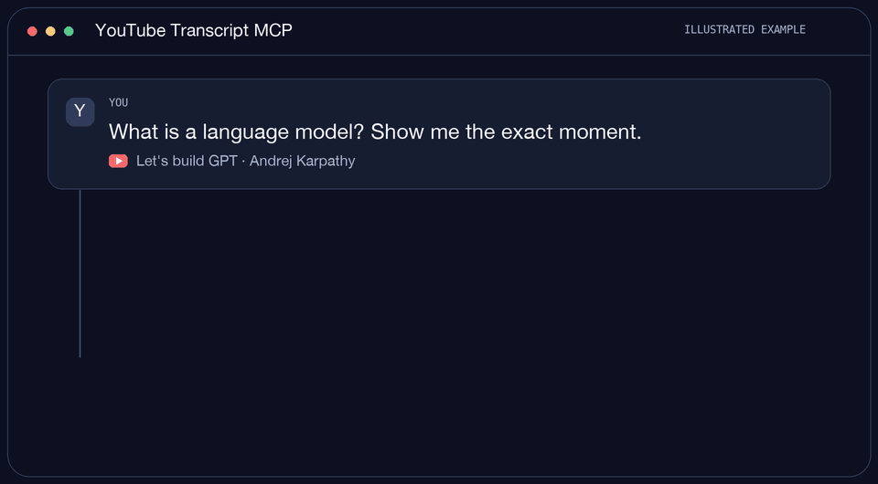

<div align="center">
  

  # YouTube Transcript MCP

  **Ask your AI about a YouTube video. Get an answer you can click back to.**

  [](https://github.com/scandolo/youtube-transcript-mcp/actions/workflows/checks.yml) [](LICENSE) [](pyproject.toml) [](https://modelcontextprotocol.io/)

  [Claude Code](#claude-code) · [Claude Cowork](#claude-cowork) · [Give setup to your agent](#give-setup-to-your-agent) · [What it does](#what-it-does)
</div>

Turn YouTube captions into readable paragraphs with chapters, timestamps, and links to the exact moment in the video. Run it **on your own computer** with Claude Code or Claude Cowork. No Railway account, residential proxy, GitHub OAuth app, or YouTube API key is needed to start. YouTube sees your normal internet connection, and the MCP server has no public URL to protect with sign-in.

<p align="center">
  <a href="https://github.com/scandolo/youtube-transcript-mcp/releases/latest/download/youtube-transcript-mcp.mcpb"></a>
</p>

<p align="center">One file to download, then open it in Claude Desktop. <a href="#claude-cowork">Cowork instructions</a> · <a href="#claude-code">Claude Code instructions</a></p>

## Contents

- [Claude Code](#claude-code)
- [Claude Cowork](#claude-cowork)
- [Give setup to your agent](#give-setup-to-your-agent)
- [Try it](#try-it)
- [What it does](#what-it-does)
- [Other MCP clients](#other-mcp-clients)
- [Remote hosting (optional)](#remote-hosting-optional)
- [Troubleshooting](#troubleshooting)
- [Configuration and security](#configuration-and-security)
- [License](#license)

## Claude Code

1. Install [Claude Code](https://docs.anthropic.com/en/docs/claude-code/setup) and [uv](https://docs.astral.sh/uv/getting-started/installation/) if you do not already have them. `uv` installs the right Python version and this server's dependencies for you.
2. Copy and run this command in your terminal:

   ```bash
   claude mcp add --scope user youtube-transcript -- "$(command -v uvx)" --from git+https://github.com/scandolo/youtube-transcript-mcp youtube-transcript-mcp
   ```

3. Open Claude Code (or start a new session) and ask it to use the **YouTube Transcript** tools on a video URL. Run `/mcp` if you want to check the connection.

The `--scope user` flag makes the tool available across your projects. The first launch downloads the package; later launches use uv's cache. To remove it, run `claude mcp remove --scope user youtube-transcript`.

## Claude Cowork

Use **Cowork in the Claude Desktop app**. Local MCP servers are available there through desktop extensions; Cowork on the web cannot run an MCP server on your laptop. [Anthropic's Cowork guide](https://support.claude.com/en/articles/15520349-use-claude-cowork-on-web-desktop-and-mobile) describes this desktop requirement.

1. Click the **Download for Claude Desktop** button above to get `youtube-transcript-mcp.mcpb`.
2. Open the file in [Claude Desktop](https://claude.com/download). If it does not open automatically, use **Settings → Extensions → Advanced settings → Install Extension…** and select the file. Claude installs its Python dependencies automatically. [Anthropic's extension guide](https://support.claude.com/en/articles/10949351-getting-started-with-local-mcp-servers-on-claude-desktop) shows the Settings flow.
3. Open **Cowork** in the desktop app and ask about a YouTube video. If Claude asks to enable or allow the tool, approve it.

Keep Claude Desktop open while using the local connector. If your organization disables local MCP servers or desktop extensions, ask your admin to enable them.

## Give setup to your agent

Copy this into Claude Code or another coding agent if you prefer guided setup:

```text
Help me set up https://github.com/scandolo/youtube-transcript-mcp locally.
Read its current README first. Ask whether I use Claude Code or Claude Cowork
in Claude Desktop, then follow the matching short path. For Claude Code,
install uv if needed and add the server with `claude mcp add --scope user`.
For Cowork, download the latest .mcpb release and walk me through installing
it in Claude Desktop Settings > Extensions. Verify the tools are connected,
then have me try a YouTube URL. Do not set up Railway, a proxy, an OAuth app,
or API keys unless I ask for remote hosting or a specific optional feature.
```

## Try it

Paste a video URL into Claude and ask:

> Use the YouTube Transcript tools to summarize this video. Link the exact moment that supports each point: `https://www.youtube.com/watch?v=kCc8FmEb1nY`

For a long video, ask for its chapters first, then ask about one chapter. To find a passage, ask: “Where does this video discuss attention? Give me the timestamp and link.”

<p align="center">
  
</p>

Illustrated example with the server's real tool names and [a moment from the sample video](https://www.youtube.com/watch?v=kCc8FmEb1nY&t=98s). [View the still image](assets/demo.png).

## What it does

| Tool | What your AI can do with it |
|---|---|
| `search_youtube` | Find videos with YouTube's search ranking. An optional YouTube Data API key enables reliable cloud search and filters. |
| `youtube_video_info` | Read title, duration, description, available captions, and chapters before fetching a long transcript. |
| `youtube_transcript` | Read the whole video, one chapter, matching passages, or a time window. Supports caption languages such as `en` and `it`. |
| `health` | Check which optional backends and settings are available without exposing secret values. |

The server tries `youtube-transcript-api`, then `yt-dlp`. An optional Groq Whisper fallback can transcribe audio when captions are unavailable; it may incur Groq charges.

## Other MCP clients

The server speaks MCP over **stdio** by default. If your app supports local stdio MCP servers, set its command to `uvx` and its arguments to:

```text
--from git+https://github.com/scandolo/youtube-transcript-mcp youtube-transcript-mcp
```

For development, clone the repo and run `uv sync`, then `uv run youtube-transcript-mcp`. No `.env` file is needed.

## Remote hosting (optional)

If you need a connector for Claude on the web or ChatGPT, you can [deploy on Railway](https://railway.com/deploy/youtube-transcript-mcp). See the [remote setup guide](docs/remote-setup.md) before deploying: hosting usually needs a **paid rotating residential proxy** and the public endpoint needs a GitHub OAuth app. Local setup avoids both. A proxy improves reliability but cannot guarantee every video works.

## Troubleshooting

| Symptom | Check |
|---|---|
| Claude Code cannot find `uvx` | Install [uv](https://docs.astral.sh/uv/getting-started/installation/), open a new terminal, and rerun the command. `command -v uvx` should print a path. |
| Cowork cannot see the tools | Use Cowork in the **desktop app**, check that the extension is enabled in **Settings → Extensions**, and start a new Cowork task. A web custom connector cannot reach this local server. |
| `IpBlocked` or no transcript | Your own IP may still be blocked by YouTube, or the video may have no captions. Try another captioned video first. See [remote setup](docs/remote-setup.md) if you need a proxy. |
| Search or chapters are missing | Add `YOUTUBE_API_KEY` with YouTube Data API v3 enabled. Search costs 100 quota units per request. |
| A working video stops working | Update the package or extension to pick up newer YouTube extraction libraries; YouTube changes its site often. |

## Configuration and security

Local stdio runs on your computer and does not need GitHub sign-in. It can make network requests to YouTube and any optional backend you configure. Only install local MCP software from sources you trust.

For advanced settings, see [.env.example](.env.example). You can add `YOUTUBE_API_KEY` for metadata and search, `GROQ_API_KEY` for audio transcription, or `YTM_PROXY` if your connection gets blocked.

## License

[MIT](LICENSE) © Federico Scandolara.
